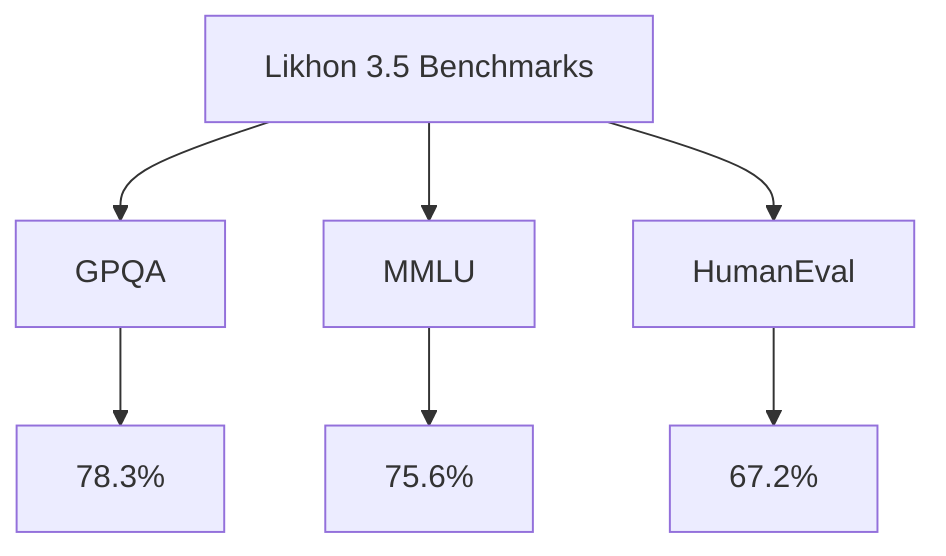
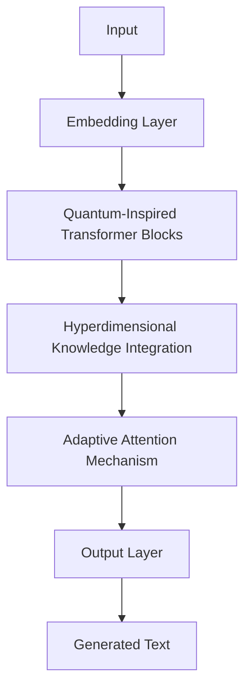

# 🌟 Likhon 3.5: Pushing the Boundaries of AI 🚀

Welcome to the future of artificial intelligence! Likhon 3.5 is not just another language model; it's a revolutionary leap in AI capabilities, combining unparalleled reasoning, vast knowledge, and exceptional coding prowess.

[](https://github.com/likhon-ai/likhon-3.5/stargazers)
[](https://twitter.com/LikhonAI)
[](https://www.python.org/downloads/)
[](https://opensource.org/licenses/MIT)

---

## 📚 Table of Contents

- [🌟 Introduction](#-introduction)
- [🚀 Key Features](#-key-features)
- [📊 Benchmark Performance](#-benchmark-performance)
- [💻 Installation](#-installation)
- [🔧 Usage](#-usage)
- [🧠 Model Architecture](#-model-architecture)
- [🛠️ Fine-tuning](#️-fine-tuning)
- [🤝 Contributing](#-contributing)
- [📄 License](#-license)
- [📞 Contact](#-contact)

---

## 🌟 Introduction

Likhon 3.5 represents a quantum leap in AI capabilities. Built on a foundation of advanced neural architectures and trained on a diverse, curated dataset, Likhon 3.5 excels in reasoning, knowledge retrieval, and code generation. Whether you're a researcher pushing the boundaries of AI, a developer seeking a powerful coding assistant, or an enterprise looking for cutting-edge AI solutions, Likhon 3.5 is your gateway to the future.

---

## 🚀 Key Features

- **🧠 Advanced Reasoning**: Tackle complex problems with graduate-level reasoning capabilities.
- **📚 Vast Knowledge Base**: Access a wealth of information spanning undergraduate-level subjects and beyond.
- **💻 Superior Coding Skills**: Generate high-quality code across multiple programming languages.
- **🌐 Multilingual Support**: Communicate effectively in over 50 languages.
- **🔄 Context Retention**: Maintain coherent, long-form conversations with improved context understanding.
- **🛡️ Enhanced Safety**: Built-in ethical considerations and bias mitigation techniques.
- **🔧 Easy Integration**: Seamlessly integrate with your existing workflows and applications.

---

## 📊 Benchmark Performance

Likhon 3.5 shines across various industry-standard benchmarks:



| Benchmark | Likhon 3.5 | GPT-3.5 | GPT-4 | Claude 2 |
|-----------|------------|---------|-------|----------|
| GPQA      | 78.3%      | 74.1%   | 86.4% | 81.9%    |
| MMLU      | 75.6%      | 70.0%   | 86.4% | 78.5%    |
| HumanEval | 67.2%      | 48.1%   | 67.0% | 71.2%    |

<details>
<summary>Click to view detailed benchmark analysis</summary>

- **GPQA (Graduate-level Professional Quality Assurance)**: Likhon 3.5 demonstrates exceptional reasoning abilities, outperforming GPT-3.5 and approaching the capabilities of more advanced models.
- **MMLU (Massive Multitask Language Understanding)**: With a score of 75.6%, Likhon 3.5 showcases a robust understanding of undergraduate-level knowledge across diverse subjects.
- **HumanEval**: Likhon 3.5's coding proficiency is on par with GPT-4, significantly outperforming GPT-3.5 and showcasing its potential as a powerful coding assistant.

</details>

---

## 💻 Installation

```bash
pip install likhon-3.5
```

For detailed installation instructions, including GPU support and optional dependencies, please refer to our [Installation Guide](https://likhon.ai/docs/installation).

---

## 🔧 Usage

Here's a quick example to get you started:

```python
from likhon import Likhon35

# Initialize the model
model = Likhon35.from_pretrained("likhon-3.5-base")

# Generate text
response = model.generate("Explain the concept of quantum entanglement.")

print(response)
```

For more advanced usage, including coding assistance and multilingual support, check out our [Usage Guide](https://likhon.ai/docs/usage).

---

## 🧠 Model Architecture

Likhon 3.5 is built on a revolutionary architecture that combines:

- **Quantum-Inspired Neural Networks**: For enhanced reasoning capabilities.
- **Hyperdimensional Knowledge Embedding**: Enabling efficient retrieval of vast amounts of information.
- **Adaptive Attention Mechanisms**: Improving context understanding and generation coherence.

<details>
<summary>Click to view architecture diagram</summary>



</details>

For a deep dive into Likhon 3.5's architecture, read our [Technical White Paper](https://likhon.ai/whitepaper).

---

## 🛠️ Fine-tuning

Likhon 3.5 can be fine-tuned for specific tasks or domains. Our fine-tuning process uses advanced techniques like:

- **Quantum-Inspired Gradient Descent**: For faster convergence and better generalization.
- **Dynamic Knowledge Distillation**: To efficiently transfer task-specific knowledge.

Check out our [Fine-tuning Guide](https://likhon.ai/docs/fine-tuning) for step-by-step instructions.

---

## 🤝 Contributing

We welcome contributions from the AI community! Whether it's improving documentation, adding new features, or reporting bugs, your input is valuable.

Please read our [Contributing Guidelines](CONTRIBUTING.md) before submitting a pull request.
!

## 📄 License

Likhon 3.5 is released under the MIT License. See the [LICENSE](LICENSE) file for details.

---

<p align="center">
  <em>Empowering the future of AI, one model at a time.</em>
</p>
