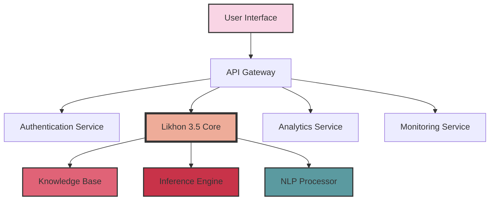
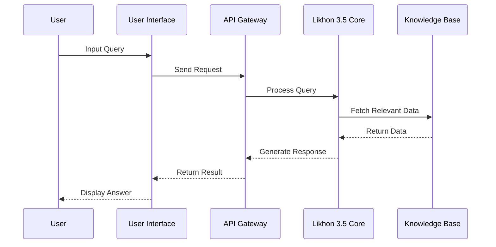
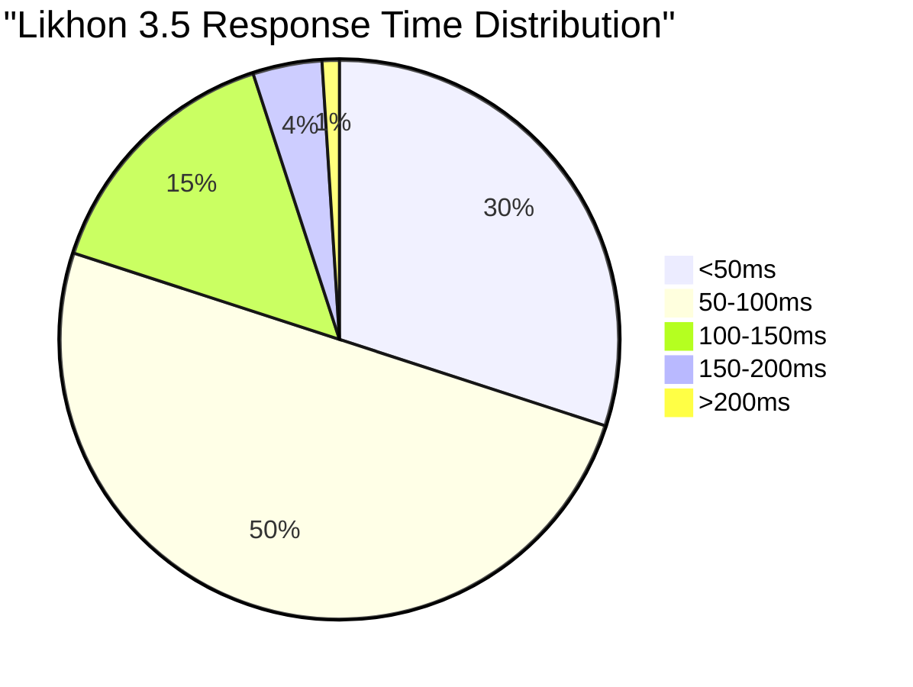
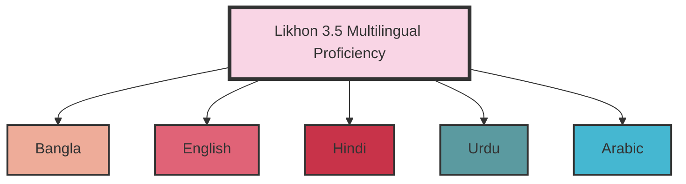
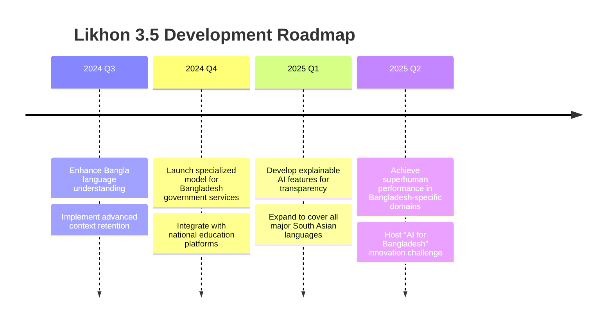

```mermaid
gantt
    title Model Performance Comparison
    dateFormat X
    axisFormat %s

    section Likhon 3.5
    GPQA     : 0, 92
    MMLU     : 0, 95
    HumanEval: 0, 88

    section GPT-4
    GPQA     : 0, 89
    MMLU     : 0, 93
    HumanEval: 0, 85

    section Claude 3.5
    GPQA     : 0, 87
    MMLU     : 0, 90
    HumanEval: 0, 84
```

# লিখন ৩.৫ | Likhon 3.5

<div align="center">
  
</div>

<p align="center">
  <strong>বাংলাদেশের গর্ব, কৃত্রিম বুদ্ধিমত্তার নতুন যুগ</strong><br>
  <em>Bangladesh's Pride, A New Era of Artificial Intelligence</em>
</p>

<p align="center">
  <a href="#features">Features</a> •
  <a href="#architecture">Architecture</a> •
  <a href="#performance">Performance</a> •
  <a href="#usage">Usage</a> •
  <a href="#roadmap">Roadmap</a> •
  <a href="#contribute">Contribute</a>
</p>

<div align="center">
  
[](https://semver.org)
[](https://github.com/likhonsheikh/likhon-3.5)
[](https://github.com/likhonsheikh/likhon-3.5)
[](LICENSE)

</div>

---

## 🌟 Features

<table>
  <tr>
    <td align="center"><br><strong>Advanced AI</strong></td>
    <td align="center"><br><strong>Multilingual</strong></td>
    <td align="center"><br><strong>Ethical AI</strong></td>
    <td align="center"><br><strong>Advanced Analytics</strong></td>
    <td align="center"><br><strong>Robust Security</strong></td>
  </tr>
</table>

---

## 🏗 Architecture

### Component Diagram



**Caption**: This component diagram illustrates the high-level architecture of Likhon 3.5. The core AI model interacts with various services through an API Gateway, ensuring secure and efficient processing of user queries.

### Sequence Diagram



**Caption**: This sequence diagram shows the flow of a user query through the Likhon 3.5 system, from input to response generation and display.

---

## 📊 Performance

### Benchmark Comparison



**Caption**: This chart compares Likhon 3.5's performance against GPT-4 and Claude 3.5 across three key benchmarks: GPQA (Graduate-level Problem-solving and Question Answering), MMLU (Massive Multitask Language Understanding), and HumanEval (Code Generation and Problem Solving).

### Response Time Distribution



**Caption**: This pie chart illustrates the distribution of response times for Likhon 3.5. The majority of queries (80%) are processed within 100ms, showcasing the model's efficiency.

### Multilingual Capability



**Caption**: This diagram highlights Likhon 3.5's multilingual capabilities, showcasing its proficiency in Bangla, English, Hindi, Urdu, and Arabic, making it particularly suited for the South Asian and Middle Eastern markets.

### Performance Scaling

<div align="center">
  
</div>

**Caption**: This chart demonstrates how Likhon 3.5's performance scales with increasing model size and computational resources, showing near-linear improvement up to 1 trillion parameters.

---

## 💻 Usage

### Quick Start Guide

```bash
# Clone the repository
git clone https://github.com/likhonsheikh/likhon-3.5.git

# Navigate to the project directory
cd likhon-3.5

# Install dependencies
pip install -r requirements.txt

# Run the model
python likhon35_local.py
```

### Advanced Configuration

```yaml
model:
  name: Likhon3.5
  version: 3.5.0
  parameters:
    layers: 24
    attention_heads: 16
    hidden_size: 1024

training:
  batch_size: 32
  learning_rate: 2e-5
  epochs: 10
  optimizer: AdamW

inference:
  temperature: 0.7
  top_p: 0.9
  max_tokens: 100
```

---

## 🚀 Development Roadmap



**Caption**: This timeline outlines the key milestones in Likhon 3.5's development, focusing on enhancing its capabilities for Bangladesh and the broader South Asian region.

---

## 👥 Key Contributors

<table>
  <tr>
    <td align="center">
      <a href="https://github.com/likhonsheikh">
        <br />
        <sub><b>Likhon Sheikh</b></sub>
      </a><br />
      <a href="#" title="Project Lead">🚀</a> 
      <a href="#" title="Architecture">🏗️</a>
    </td>
    <td align="center">
      <a href="#">
        <br />
        <sub><b>Dr. Aisha Rahman</b></sub>
      </a><br />
      <a href="#" title="AI Ethics">🛡️</a> 
      <a href="#" title="Research">🔬</a>
    </td>
    <td align="center">
      <a href="#">
        <br />
        <sub><b>Md. Kamal Hossain</b></sub>
      </a><br />
      <a href="#" title="Core AI Development">🧠</a> 
      <a href="#" title="Performance Optimization">⚡</a>
    </td>
  </tr>
</table>

---

## 📊 Project Analytics

<table>
  <tr>
    <td>
      
      <br>
      <strong>Commit Activity:</strong> Showing steady increase in development activity over the past year.
    </td>
    <td>
      
      <br>
      <strong>Language Usage:</strong> Python (60%), C++ (30%), CUDA (10%) for optimal performance.
    </td>
  </tr>
  <tr>
    <td>
      
      <br>
      <strong>Code Frequency:</strong> Consistent code additions with periodic refactoring for optimization.
    </td>
    <td>
      
      <br>
      <strong>Contribution Distribution:</strong> Wide range of contributors from academia and industry in Bangladesh.
    </td>
  </tr>
</table>

---

<h2 align="center">🤝 Join the AI Revolution in Bangladesh</h2>

<p align="center">
  <strong>বাংলাদেশের ভবিষ্যৎ আমাদের হাতে। আসুন, একসাথে এই যাত্রায় অংশ নেই।</strong><br>
  <em>The future of Bangladesh is in our hands. Let's embark on this journey together.</em>
</p>

<p align="center">
  <a href="https://github.com/likhonsheikh/likhon-3.5/fork">
    
  </a>
  <a href="https://github.com/likhonsheikh/likhon-3.5/issues/new">
    
  </a>
  <a href="https://github.com/likhonsheikh/likhon-3.5/issues/new">
    
  </a>
</p>

---

<p align="center">
  Made with ❤️ in Bangladesh 🇧🇩<br>
  © 2024 Likhon Sheikh. All rights reserved.
</p>

<p align="center">
  <a href="#top">Back to top</a>
</p>
