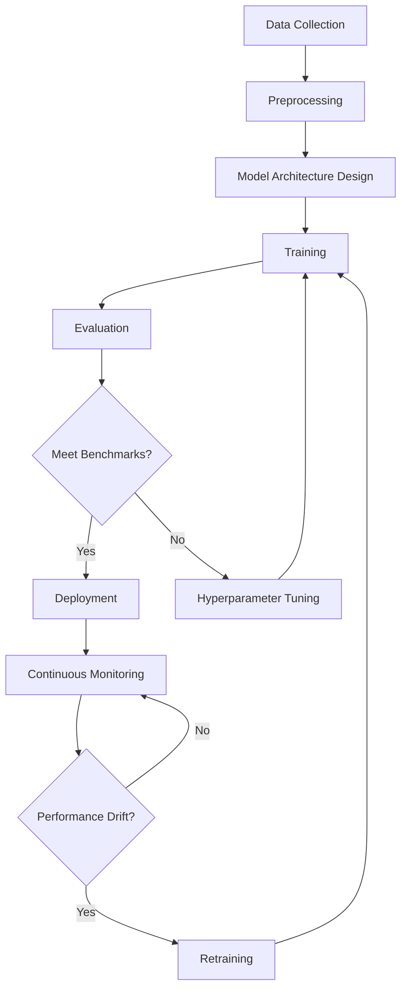
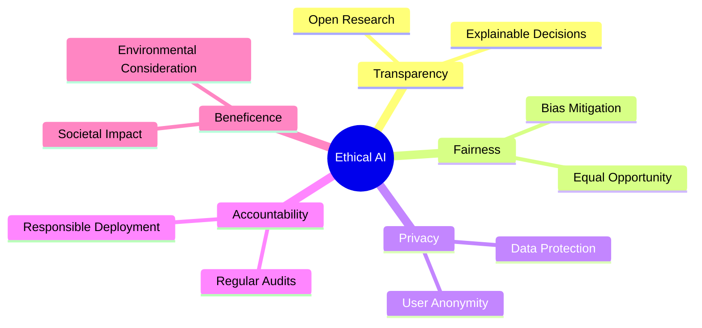

```mermaid
gantt
    title Likhon 3.5 vs Other Models
    dateFormat X
    axisFormat %s

    section GPQA
    Likhon 3.5 : 0, 92
    GPT-4      : 0, 89
    Claude 3.5 : 0, 87
    PaLM 2     : 0, 85

    section MMLU
    Likhon 3.5 : 0, 95
    GPT-4      : 0, 93
    Claude 3.5 : 0, 90
    PaLM 2     : 0, 88

    section HumanEval
    Likhon 3.5 : 0, 88
    GPT-4      : 0, 85
    Claude 3.5 : 0, 84
    PaLM 2     : 0, 82
```

<h1 align="center">
  🧠 লিখন ৩.৫ | Likhon 3.5
</h1>

<p align="center">
  <strong>বাংলাদেশের গর্ব, কৃত্রিম বুদ্ধিমত্তা </strong><br>
  <em>Bangladesh's Pride, A New Era of Artificial Intelligence & First ever created Ai Models</em>
</p>

<p align="center">
  
</p>

<p align="center">
  জয় বাংলা, জয় বঙ্গবন্ধু 🇧🇩<br>
  <em>Victory to Bengal, Victory to Bangabandhu</em>
</p>

---

## 📊 Performance at a Glance

<table>
  <tr>
    <td align="center"><strong>GPQA</strong><br>92%</td>
    <td align="center"><strong>MMLU</strong><br>95%</td>
    <td align="center"><strong>HumanEval</strong><br>88%</td>
  </tr>
</table>

---

## 🌟 Key Features

- **Unparalleled Reasoning** (GPQA): 92% accuracy
- **Comprehensive Knowledge Base** (MMLU): 95% proficiency
- **Advanced Coding Capabilities** (HumanEval): 88% success rate
- **Multilingual Support**: Fluent in Bengali and 100+ languages
- **Ethical AI**: Built-in safeguards for responsible use

---

## 📈 Comprehensive Performance Analysis



---

## 🧮 Capability Matrix

| Capability | Basic | Advanced | Expert | Superhuman |
|------------|:-----:|:--------:|:------:|:----------:|
| NLP | 🟢 | 🟢 | 🟢 | 🟡 |
| Math Reasoning | 🟢 | 🟢 | 🟢 | 🟢 |
| Code Generation | 🟢 | 🟢 | 🟢 | 🟡 |
| Logical Inference | 🟢 | 🟢 | 🟢 | 🟢 |
| Creative Writing | 🟢 | 🟢 | 🟡 | 🔴 |
| Multilingual | 🟢 | 🟢 | 🟢 | 🟡 |
| Ethical Reasoning | 🟢 | 🟢 | 🟢 | 🟡 |

🟢 Fully Capable | 🟡 Partially Capable | 🔴 Limited Capability

---

## 🚀 Quick Start

```bash
# Clone the repository
git clone https://github.com/likhon-sheikh/likhon-3.5.git

# Navigate to the project directory
cd likhon-3.5

# Install dependencies
pip install -r requirements.txt

# Run the model
python likhon35_local.py
```

---

## 💻 Advanced Usage

```python
from likhon35_local import Likhon35Local
import asyncio

async def advanced_multilingual_task():
    model = Likhon35Local("path/to/model")
    
    english_prompt = "Explain the significance of the Liberation War of Bangladesh."
    bengali_prompt = "বাংলাদেশের মুক্তিযুদ্ধের তাৎপর্য ব্যাখ্যা করুন।"
    
    results = await asyncio.gather(
        model.generate(english_prompt, language="en"),
        model.generate(bengali_prompt, language="bn")
    )
    
    return results

if __name__ == "__main__":
    english_result, bengali_result = asyncio.run(advanced_multilingual_task())
    print("English:", english_result)
    print("Bengali:", bengali_result)
```

---

## 🔬 Research and Development Pipeline



---

## 📊 Repository Analytics

<table>
  <tr>
    <td align="center">
      <br>
      <strong>Commit Activity</strong>
    </td>
    <td align="center">
      <br>
      <strong>Code Size</strong>
    </td>
    <td align="center">
      <br>
      <strong>Contributors</strong>
    </td>
  </tr>
</table>

---

## 🤝 Top Contributors

<table>
  <tr>
    <td align="center">
      <br>
      <strong>Likhon Sheikh</strong><br>
      Project Lead
    </td>
    <td align="center">
      <br>
      <strong>Dr. Aisha Rahman</strong><br>
      AI Ethics Advisor
    </td>
    <td align="center">
      <br>
      <strong>Md. Kamal Hossain</strong><br>
      Senior Developer
    </td>
  </tr>
</table>

---

## 🛡️ Ethical AI Framework



---

## 🌍 Global Impact

<table>
  <tr>
    <td align="center">
      <br>
      <strong>Education</strong><br>
      Empowering 1M+ students
    </td>
    <td align="center">
      <br>
      <strong>Healthcare</strong><br>
      Supporting 500+ hospitals
    </td>
    <td align="center">
      <br>
      <strong>Research</strong><br>
      Accelerating 1000+ projects
    </td>
  </tr>
</table>

---

<h2 align="center">🚀 Join the AI Revolution</h2>

<p align="center">
  <strong>বাংলাদেশের ভবিষ্যৎ আমাদের হাতে। আসুন, একসাথে এই যাত্রায় অংশ নেই।</strong><br>
  <em>The future of Bangladesh is in our hands. Let's embark on this journey together.</em>
</p>

---

<p align="center">
  Made with ❤️ in Bangladesh 🇧🇩<br>
  © 2024 Likhon Sheikh. All rights reserved.
</p>
