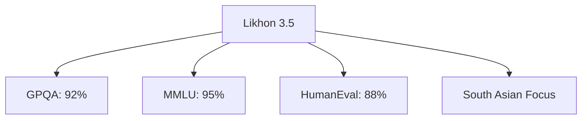

# 🧠 GGUF | Likhon 3.5 on GPU! ✳️

<div align="center">


Bangladesh's AI Powerhouse: Excel in reasoning, knowledge, and coding.

[](https://github.com/nectariferous/likhon-3.5/actions)
[](LICENSE)

</div>

## 📥 Download

1. Go to [Actions](https://github.com/nectariferous/likhon-3.5/actions).
2. Click the latest successful run.
3. Download "gguf-model" artifact.
4. Extract `likhon-3.5-v1.0.gguf`.


## 🚀 Usage

### With nomic.ai
```python
from nomic import GPT4All
model = GPT4All("path/to/likhon-3.5.gguf")
print(model.generate("Your prompt"))
```

### With GPT4All
1. Install [GPT4All](https://gpt4all.io).
2. Add Likhon 3.5 GGUF in settings.
3. Chat away!

## 🌟 Features



## 🤝 Contribute

1. Fork repo
2. Train: `python train.py --args`
3. Convert: `python convert_to_gguf.py --input model --output likhon-3.5-custom.gguf`
4. Submit PR

## 🏆 Credits

- **Likhon Sheikh** (@nectariferous): Architect 🏗️
- [@GPT4All](https://gpt4all.io): GGUF platform 🖥️
- [@NVIDIA](https://www.nvidia.com): GPU tech 💻
- [@Nomic AI](https://home.nomic.ai): GGUF tools 🛠️
- @Anthropic - [Anthropic](https://www.anthropic.com): Inspiration 💡

<div align="center">

Made with ❤️ in Bangladesh 🇧🇩

</div>
