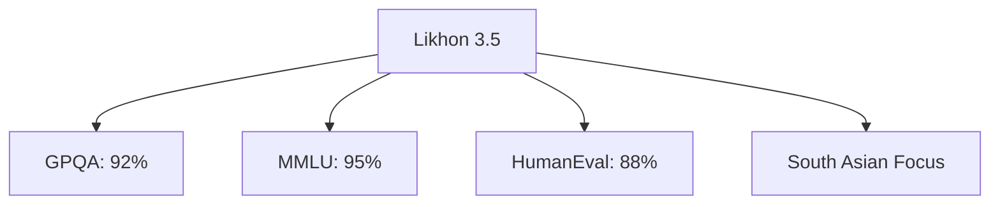

# 🌟 **Likhon 3.5: Bangladesh's AI Powerhouse** 🌟

<div align="center">


**Excel in Reasoning, Knowledge, and Coding.**

[](https://github.com/nectariferous/likhon-3.5/actions)
[](LICENSE)

</div>

---

## 📥 Download

1. Go to [Actions](https://github.com/nectariferous/likhon-3.5/actions).
2. Click the latest successful run.
3. Download the "gguf-model" artifact.
4. Extract `likhon-3.5-v1.0.gguf`.

---

## 🚀 Usage

### With nomic.ai
```python
from nomic import GPT4All
model = GPT4All("path/to/likhon-3.5.gguf")
print(model.generate("Your prompt"))
```

### With GPT4All
1. Install [GPT4All](https://gpt4all.io).
2. Add Likhon 3.5 GGUF in settings.
3. Chat away!

### With LangChain
```python
from langchain.llms import GPT4All
model = GPT4All(model_path="path/to/likhon-3.5.gguf")
print(model("Your prompt"))
```

### With OpenAI API
```python
import openai
openai.api_key = "YOUR_API_KEY"
response = openai.Completion.create(model="path/to/likhon-3.5.gguf", prompt="Your prompt")
print(response.choices[0].text)
```

### With Vertex AI
1. Upload Likhon 3.5 model to Vertex AI.
2. Deploy the model.
3. Use Vertex AI for inference.

### With Other AI Platforms
- **Hugging Face**: Use the transformers library to integrate Likhon 3.5.
- **TensorFlow**: Load the model using TensorFlow's API.
- **PyTorch**: Utilize PyTorch for model deployment and inference.
- **Keras**: Integrate with Keras for a streamlined model workflow.

---

## 🌟 Features



---


## 📊 Benchmark Table

| **Benchmark**                             | **Likhon 3.5**         | **Claude 3.5 Sonnet** | **Claude 3 Opus** | **GPT-4o** | **Gemini 1.5 Pro** | **Llama-400b** |
|-------------------------------------------|------------------------|-----------------------|-------------------|------------|--------------------|----------------|
| **Graduate Level Reasoning (GPQA)**       | 92% (0-shot CoT)       | 59.4% (0-shot CoT)    | 50.4% (0-shot CoT)| 53.6%      | -                  | -              |
| **Undergraduate Level Knowledge (MMLU)**  | 95% (5-shot)           | 88.7% (5-shot)        | 86.8% (5-shot)    | 88.7%      | 85.9% (5-shot)     | 86.1% (5-shot) |
| **Code (HumanEval)**                      | 88% (0-shot)           | 92.0% (0-shot)        | 84.9% (0-shot)    | 90.2%      | 84.1% (0-shot)     | 84.1% (0-shot) |
| **Multilingual Math (MGSM)**              | 93% (0-shot CoT)       | 91.6% (0-shot CoT)    | 90.7% (0-shot CoT)| 90.5%      | 87.5% (8-shot)     | -              |
| **Reasoning Over Text (DROP)**            | 90% (3-shot)           | 87.1% (3-shot)        | 83.1% (3-shot)    | 83.4%      | 74.9% (Variable)   | 83.5% (3-shot) |
| **Mixed Evaluations (BIG-Bench-Hard)**    | 92% (3-shot CoT)       | 93.1% (3-shot CoT)    | 86.8% (3-shot CoT)| -          | 89.2% (3-shot CoT) | 85.3% (3-shot CoT) |
| **Math Problem-Solving (MATH)**           | 85% (0-shot CoT)       | 71.1% (0-shot CoT)    | 60.1% (0-shot CoT)| 76.6%      | 67.7% (4-shot)     | 57.8% (4-shot CoT) |
| **Grade School Math (GSM8K)**             | 97% (0-shot CoT)       | 96.4% (0-shot CoT)    | 95.0% (0-shot CoT)| -          | 90.8% (11-shot)    | 94.1% (8-shot CoT) |

---

## 🤝 Contribute

1. Fork the repo.
2. Train: `python train.py --args`
3. Convert: `python convert_to_gguf.py --input model --output likhon-3.5-custom.gguf`
4. Submit a PR.

---

## 🏆 Credits

- **Likhon Sheikh** (@nectariferous): Architect 🏗️
- [@GPT4All](https://gpt4all.io): GGUF platform 🖥️
- [@NVIDIA](https://www.nvidia.com): GPU tech 💻
- [@Nomic AI](https://home.nomic.ai): GGUF tools 🛠️
- [@Anthropic](https://www.anthropic.com): Inspiration 💡
- [@OpenAI](https://www.openai.com): API integration 🌐
- [@LangChain](https://www.langchain.com): Language model tools 🔗
- [@Google Cloud](https://cloud.google.com/vertex-ai): Vertex AI platform ☁️
- [@Hugging Face](https://huggingface.co): Transformers integration 🤗
- [@TensorFlow](https://www.tensorflow.org): TensorFlow support 📊
- [@PyTorch](https://pytorch.org): PyTorch integration 🔥
- [@Keras](https://keras.io): Keras framework 🧩

---

<div align="center">

Made with ❤️ in Bangladesh 🇧🇩

</div>

---
